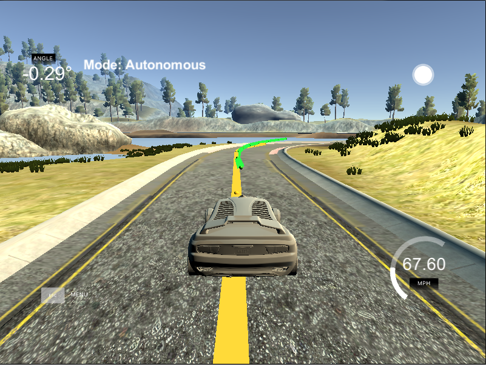
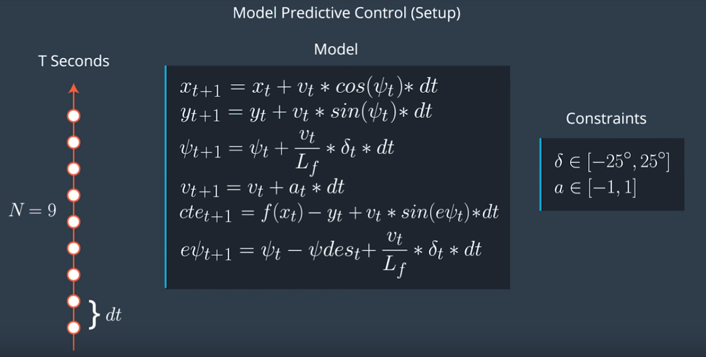

# MPC Controller
[](http://www.udacity.com/drive)



In this project I use Model Predictive Control to control the vehicle in the Udacity CarND Term2 simulator. This time the simulator provides position, velocity, orientation angle and waypoints for the center of the track. 

The goal is to go safely through the track as fast as possible. As a challenge to this project, the model should also deal with 100 mls latency. 

The video of final model in action is available [here](./videos_out/final_result.mp4).

# The Model

The "kinematic model", which is used in this project, takes to the account vehicle's (px, py) coordinates, psi (orientation angle), velocity, cross-track error and psi error which is called "epsi". The model outputs acceleration and steering angle which are the "actuators" of the model. 

The equations for the kinematic model are given below: 



# Timestep Length and Elapsed Duration (N & dt)

My timestep length and elapsed dutation are 10 and 0.1 respectively. They were given as the initial setup in the MPC Controller Q&A video provided by Udacity and worked actually better than other pairs of this values. 
I've tried setting up lesser Timestep length and bigger elapsed duration, but it leads to the less smooth behavior of the car on the road. I also tried setting up higher N and lesser dt (as 15/0.05 and 20/0.05) but it did not work out well because the car had unpredictable behavior and crashed in one of the sharp turns. I think it was due to the increased computational time and the time limit which was setted up for the solver.  

# Polynomial Fitting and MPC Preprocessing

I preprocess given waypoints in main.cpp in these lines of code in main.cpp:

```
for (int i = 0; i < ptsx.size(); i++ ) {
	// shift car reference angle to 90 degrees
	// this step helps with the polyfit later because 
	// it simplifies representation of the car and the line of waypoints
	double shift_x = ptsx[i] - px;
	double shift_y = ptsy[i] - py;

	ptsx[i] = (shift_x * cos(psi) + shift_y * sin(psi));
	ptsy[i] = (-(shift_x * sin(psi)) + shift_y * cos(psi));
}
```

This way an initial state with px = 0, py = 0, psi = 0 is achieved, which simplifies fitting a polynomial to the waypoints later.  

# Model Predictive Control with Latency

To account the latency in this task, I used the same equations for the kinematic model, as I used in the MPC Controller itself. 
I just take dt as 100 mls and calculate vehicle's state 100 mls later using the following code in the main.cpp:

```
px = px + v * cos(psi) * dt;
py = py + v * sin(psi) * dt;
psi = psi - (v / Lf) * steer_value * dt; 
v = v + throttle_value * dt; 
cte = cte + v * sin(epsi) * dt;
epsi = epsi + (v / Lf) * steer_value * dt;
```

And when I feed predicted state to the MPC Controller. This approach worked pretty well right after implementation, so I did not used more sophisticated methods to deal with the latency.

---

## Dependencies

* cmake >= 3.5
 * All OSes: [click here for installation instructions](https://cmake.org/install/)
* make >= 4.1(mac, linux), 3.81(Windows)
  * Linux: make is installed by default on most Linux distros
  * Mac: [install Xcode command line tools to get make](https://developer.apple.com/xcode/features/)
  * Windows: [Click here for installation instructions](http://gnuwin32.sourceforge.net/packages/make.htm)
* gcc/g++ >= 5.4
  * Linux: gcc / g++ is installed by default on most Linux distros
  * Mac: same deal as make - [install Xcode command line tools]((https://developer.apple.com/xcode/features/)
  * Windows: recommend using [MinGW](http://www.mingw.org/)
* [uWebSockets](https://github.com/uWebSockets/uWebSockets)
  * Run either `install-mac.sh` or `install-ubuntu.sh`.
  * If you install from source, checkout to commit `e94b6e1`, i.e.
    ```
    git clone https://github.com/uWebSockets/uWebSockets
    cd uWebSockets
    git checkout e94b6e1
    ```
    Some function signatures have changed in v0.14.x. See [this PR](https://github.com/udacity/CarND-MPC-Project/pull/3) for more details.

* **Ipopt and CppAD:** Please refer to [this document](https://github.com/udacity/CarND-MPC-Project/blob/master/install_Ipopt_CppAD.md) for installation instructions.
* [Eigen](http://eigen.tuxfamily.org/index.php?title=Main_Page). This is already part of the repo so you shouldn't have to worry about it.
* Simulator. You can download these from the [releases tab](https://github.com/udacity/self-driving-car-sim/releases).
* Not a dependency but read the [DATA.md](./DATA.md) for a description of the data sent back from the simulator.


## Basic Build Instructions

1. Clone this repo.
2. Make a build directory: `mkdir build && cd build`
3. Compile: `cmake .. && make`
4. Run it: `./mpc`.
